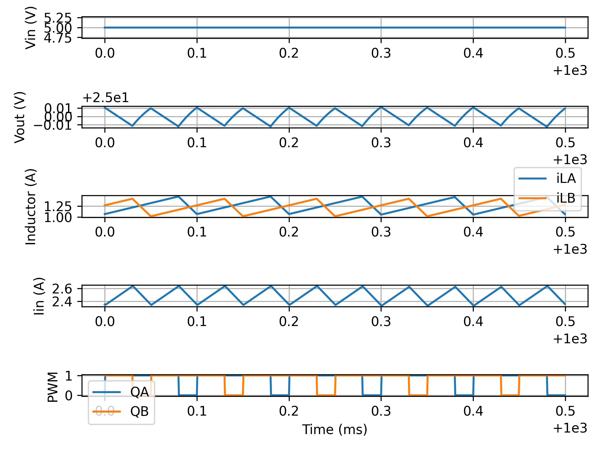

# PFC

# General Continuous-Time State-Space Form

$$
	\dot{\mathbf{x}}(t) = A\mathbf{x}(t) + B\mathbf{u}(t)
	$$
	$$
	\mathbf{y}(t) = C\mathbf{x}(t) + D\mathbf{u}(t)
$$

---

$$
	\underbrace{ \left(
	\begin{matrix}
		\dot{x}_{1}(t) \\
		\dot{x}_{2}(t) \\
		\dots \\
		\dot{x}_{n}(t)
	\end{matrix}
	\right) }_{ \dot{x}(t) }
	=
	\underbrace{ \left(
	\begin{matrix}
	A_{11}, A_{12} \dots A_{1n} \\
	A_{21}, A_{22} \dots A_{2n} \\
	\dots \\
	A_{n1}, A_{n2} \dots A_{nn}
	\end{matrix}
	\right) }_{ A }
	\underbrace{ \left(
	\begin{matrix}
	x_{1}(t) \\
	x_{2}(t) \\
	\dots \\
	x_{n}(t)
	\end{matrix}
	\right) }_{ x(t) }
	+ 
	\underbrace{ \left(
	\begin{matrix}
	B_{1} \\
	B_{2} \\
	\dots \\
	B_{n}
	\end{matrix}
	\right) }_{ B }	
	u(t)
$$

$$
y(t) = \underbrace{ [C_{1}, C_{2},\dots C_{n}] }_{ C } 
\underbrace{ \left(
\begin{matrix}
x_{1}(t) \\
x_{2}(t) \\
\dots \\
x_{n}(t)
\end{matrix}
\right) }_{ x(t) }
+
Du(t)
$$

# State Variables

## Large Signal Model

$$
\begin{align}
	x &= 
	\begin{bmatrix}
	i_{L_{A}}(t) \\
	i_{L_{B}}(t) \\
	v_{\text{out}}(t)
	\end{bmatrix}
	& \dot{x} = 
	\begin{bmatrix}
	\dot{i}_{L_{A}}(t) \\
	\dot{i}_{L_{B}}(t) \\
	\dot{v}_{\text{out}}(t)
	\end{bmatrix}
	&& u=v_{\text{in}}
	&& y=v_{\text{out}}
\end{align}
$$

The two switches are $180\degree$ out of phase. This means that the system will have 4 different states of operation. There will be a point where $\text{q}_{\text{A}}$ will be high and $\text{q}_{B}$ low and vise versa, if $\text{D}>0.5$ there will also be a point where both $\text{q}_{\text{A}}$ and $\text{q}_{B}$ will be high simultaneously. If $D < 0.5$  there will be a point where $\text{q}_{\text{A}}$ and $\text{q}_{\text{B}}$ both will be low simultaneously. This makes 4 states:

#### State 1: $\text{q}_{\text{A}}$ & $\text{q}_{\text{B}}$ are high

$$
\begin{align}
v_{L_{A}}(t) &= L \frac{di_{\text{L}_{A}}(t)}{dt} \implies \frac{di_{\text{L}_{A}}(t)}{dt} = \frac{v_{\text{in}}(t)}{L} \\ \\
v_{L_{B}}(t) &= L \frac{di_{\text{L}_{B}}(t)}{dt} \implies \frac{di_{\text{L}_{B}}(t)}{dt} = \frac{v_{\text{in}}(t)}{L} \\ \\
i_{c}(t) &= C \frac{d v_{c}(t)}{dt} \implies \frac{d v_{c}(t)}{dt} = \frac{i_{c}(t)}{C} = -\frac{v_{\text{out}}(t)}{RC}
\end{align}
$$

Both switches are turned on thus both inductors are getting magnetized. The capacitor isnt being charged at this point by any inductor meaning that it is only being discharged to the load, hence why the current is negative.

#### State 2: $\text{q}_{\text{A}}$ high & $\text{q}_{\text{B}}$ low

$$
\begin{align}
v_{L_{A}}(t) &= L \frac{di_{\text{L}_{A}}(t)}{dt} \implies \frac{di_{\text{L}_{A}}(t)}{dt} = \frac{v_{\text{in}}(t)}{L} \\ \\
v_{L_{B}}(t) &= L \frac{di_{\text{L}_{B}}(t)}{dt} \implies \frac{di_{\text{L}_{B}}(t)}{dt} = \frac{v_{\text{in}}(t) - v_{\text{out}}(t)}{L} \\ \\
i_{c}(t) &= C \frac{d v_{c}(t)}{dt} \implies \frac{d v_{c}(t)}{dt} = \frac{i_{c}(t)}{C} = \frac{i_{\text{L}_{B}}(t)}{C} -\frac{v_{\text{out}}(t)}{RC}
\end{align}
$$

Inductor A is still getting magnetized while inductor B is getting demagnetized. The energy from inductor B is being used to charge the output capacitor. 

#### State 3: $\text{q}_{\text{A}}$ low & $\text{q}_{\text{B}}$ high

$$
\begin{align}
v_{L_{A}}(t) &= L \frac{di_{\text{L}_{A}}(t)}{dt} \implies \frac{di_{\text{L}_{A}}(t)}{dt} = \frac{v_{\text{in}}(t) - v_{\text{out}}(t)}{L} \\ \\
v_{L_{B}}(t) &= L \frac{di_{\text{L}_{B}}(t)}{dt} \implies \frac{di_{\text{L}_{B}}(t)}{dt} = \frac{v_{\text{in}}(t)}{L} \\ \\
i_{c}(t) &= C \frac{d v_{c}(t)}{dt} \implies \frac{d v_{c}(t)}{dt} = \frac{i_{c}(t)}{C} = \frac{i_{\text{L}_{A}}(t)}{C} -\frac{v_{\text{out}}(t)}{RC}
\end{align}
$$

Now Inductor B is getting magnetized while inductor A is getting demagnetized. The energy from inductor A is being used to charge the output capacitor. 

#### State 4: $\text{q}_{\text{A}}$ low & $\text{q}_{\text{B}}$ low

$$
\begin{align}
v_{L_{A}}(t) &= L \frac{di_{\text{L}_{A}}(t)}{dt} \implies \frac{di_{\text{L}_{A}}(t)}{dt} = \frac{v_{\text{in}}(t) - v_{\text{out}}(t)}{L} \\ \\
v_{L_{B}}(t) &= L \frac{di_{\text{L}_{B}}(t)}{dt} \implies \frac{di_{\text{L}_{B}}(t)}{dt} = \frac{v_{\text{in}}(t) - v_{\text{out}}(t)}{L} \\ \\
i_{c}(t) &= C \frac{d v_{c}(t)}{dt} \implies \frac{d v_{c}(t)}{dt} = \frac{i_{c}(t)}{C} = \frac{i_{\text{L}_{A}}(t) + i_{\text{L}_{B}}(t)}{C} -\frac{v_{\text{out}}(t)}{RC}
\end{align}
$$

In this last state both the switches are off meaning that both the inductors are getting demagnetized into the capacitor. Having two or more inductors switching with some offset will make the capacitor get charged more frequently thus reducing the voltage ripple on the output. 

